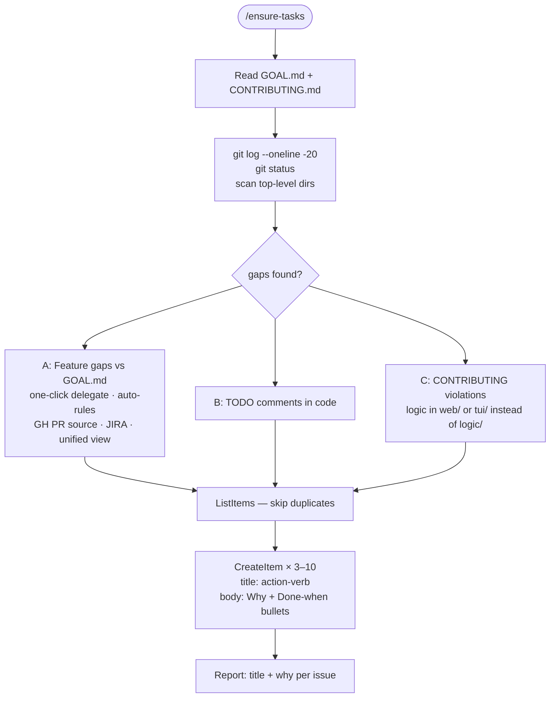

Generate 3–10 Centy issues when backlog is empty. Every issue must advance GOAL.md.

```mermaid
flowchart TD
    A([/ensure-tasks]) --> B[Read GOAL.md + CONTRIBUTING.md]
    B --> C["git log --oneline -20<br>git status<br>scan top-level dirs"]
    C --> D{gaps found?}

    D --> E["A: Feature gaps vs GOAL.md<br>one-click delegate · auto-rules<br>GH PR source · JIRA · unified view"]
    D --> F[B: TODO comments in code]
    D --> G["C: CONTRIBUTING violations<br>logic in web/ or tui/ instead of logic/"]

    E & F & G --> H[ListItems — skip duplicates]
    H --> I["CreateItem × 3–10<br>title: action-verb<br>body: Why + Done-when bullets"]
    I --> J[Report: title + why per issue]
```

Issue priority: A → B → C. `project_path` = cwd, `item_type` = `"issue"`.
