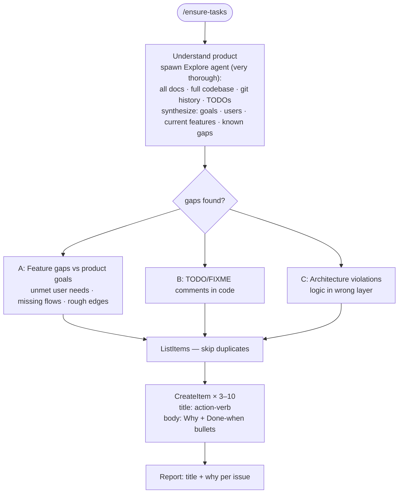

Generate 3–10 Centy issues when backlog is empty. Every issue must advance the product's core value for its users.

```mermaid
flowchart TD
    A([/ensure-tasks]) --> B["Understand product<br>spawn Explore agent (very thorough):<br>all docs · full codebase · git history · TODOs<br>synthesize: goals · users · current features · known gaps"]
    B --> D{gaps found?}

    D --> E["A: Feature gaps vs product goals<br>unmet user needs · missing flows · rough edges"]
    D --> F[B: TODO/FIXME comments in code]
    D --> G["C: Architecture violations<br>logic in wrong layer"]

    E & F & G --> H[ListItems — skip duplicates]
    H --> I["CreateItem × 3–10<br>title: action-verb<br>body: Why + Done-when bullets"]
    I --> J[Report: title + why per issue]
```

Issue priority: A → B → C. `project_path` = cwd, `item_type` = `"issue"`.
