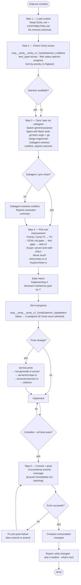

```mermaid
flowchart TD
    START(["/improve invoked"]) --> S1

    S1["Step 1 — Load context
    Read GOAL.md + CONTRIBUTING.md
    No memory shortcuts"]

    S1 --> S2["Step 2 — Check Centy issues
    mcp__centy__centy_v1_CentyDaemon_ListItems
    item_type=issues · filter status open/in-progress
    Sort by priority (1=highest)"]

    S2 --> CENTY_OK{Daemon available?}
    CENTY_OK -- no --> S3
    CENTY_OK -- yes --> S3

    S3["Step 3 — Sync repo via subagent
    Spawn general-purpose Agent with Bash tools:
    git fetch origin + git merge origin/main
    Subagent resolves conflicts, reports outcome"]

    S3 --> SYNC_OK{Subagent: sync clean?}
    SYNC_OK -- yes --> S4
    SYNC_OK -- no --> CONFLICT["Subagent resolves conflicts
    Reports resolution summary"]
    CONFLICT --> S4

    S4["Step 4 — Pick one improvement
    Priority: Centy P1 → P2 → GOAL.md gaps → test gaps → web UI
    Scope: server/ and web/ ONLY
    Never touch cli/src/main.rs or mcp/src/main.rs"]

    S4 --> DECLARE["State intent:
    'Implementing X because it advances goal by Y'"]

    DECLARE --> SET_WIP["Set in-progress
    mcp__centy__centy_v1_CentyDaemon_UpdateItem
    status → in-progress (if Centy issue selected)"]

    SET_WIP --> PROTO{Proto change?}

    PROTO -- yes --> PROTO_FLOW["service.proto
    → buf generate in server/
    → server/src/repo.rs
    → server/src/service.rs
    → web/src/"]
    PROTO -- no --> IMPL

    PROTO_FLOW --> IMPL["Implement"]

    IMPL --> VERIFY{Compiles + all tests pass?}
    VERIFY -- no --> IMPL
    VERIFY -- yes --> S5

    S5["Step 5 — Commit + push
    Conventional commit message
    git push immediately (no batching)"]

    S5 --> PUSH_OK{Push succeeds?}
    PUSH_OK -- no --> FIX["Fix pre-push failure
    New commit or amend"]
    FIX --> S5
    PUSH_OK -- yes --> COMPACT["Compact conversation
    /compact"]
    COMPACT --> REPORT["Report: what changed · why it matters · what's next"]
    REPORT --> DONE([done])
```
